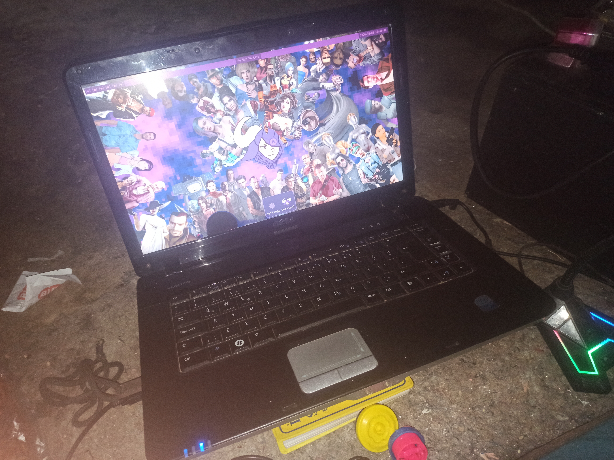
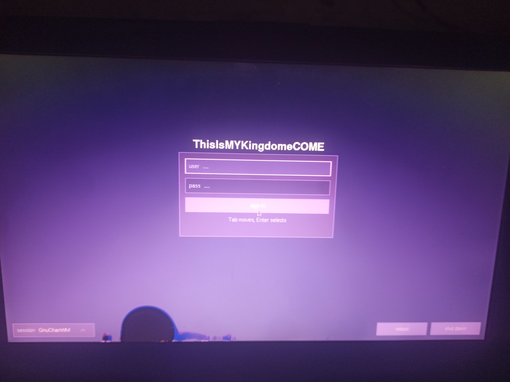
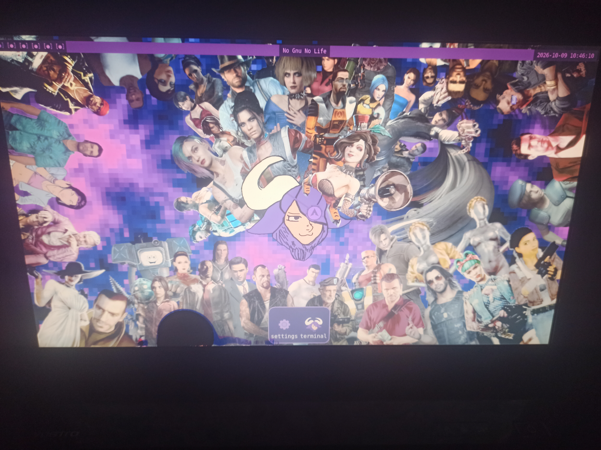
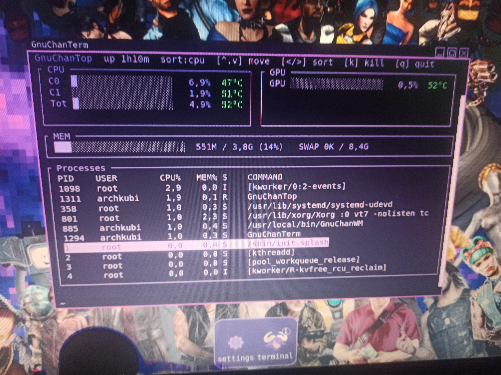
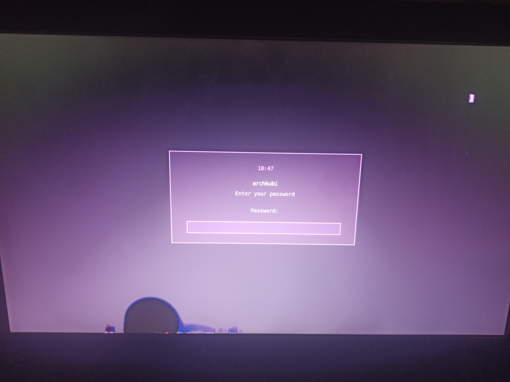
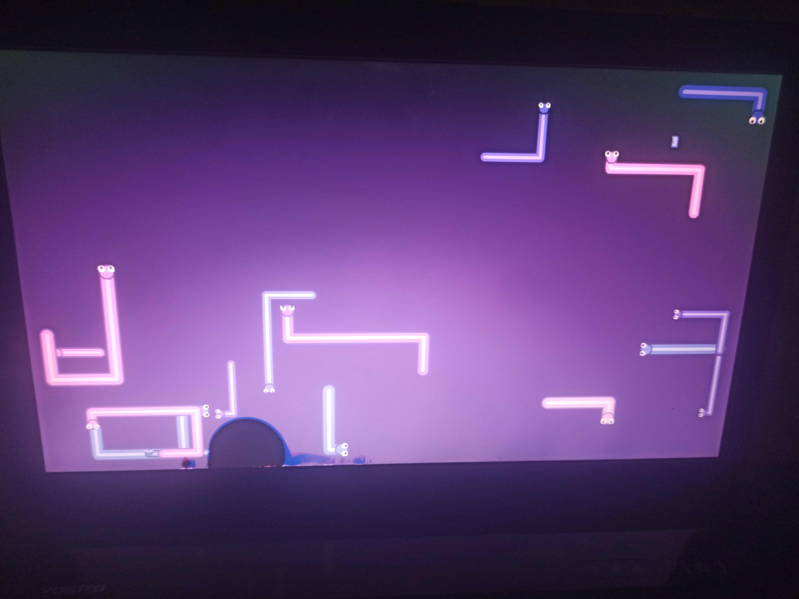
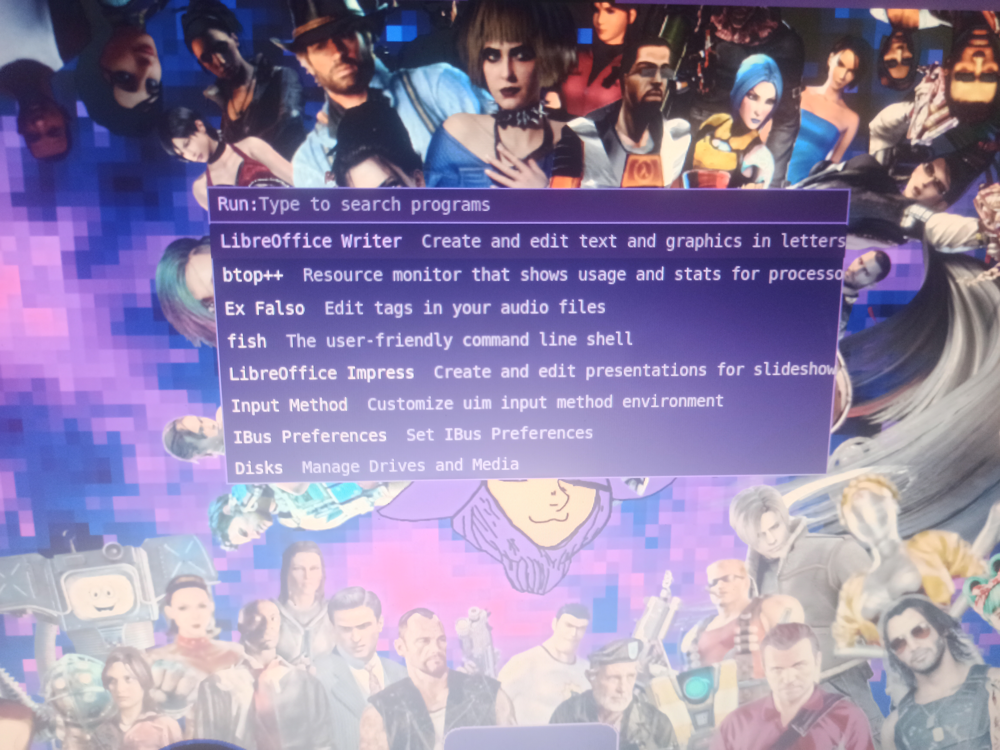
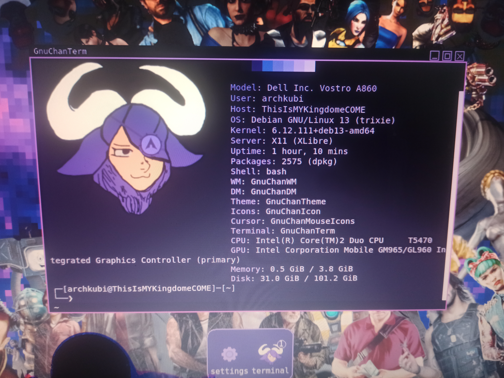
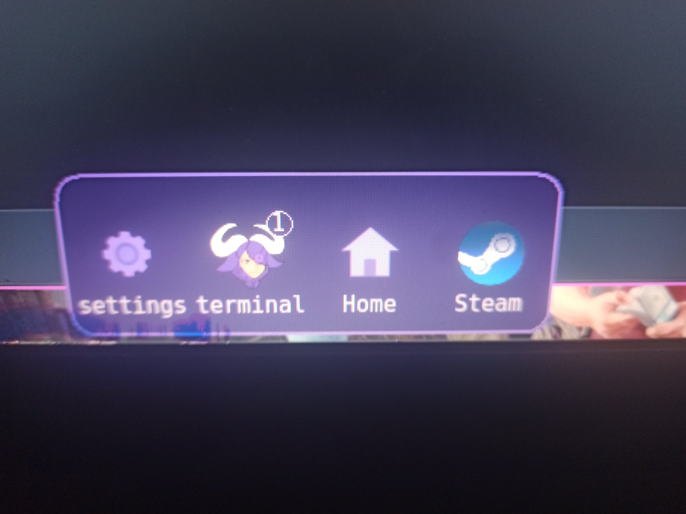
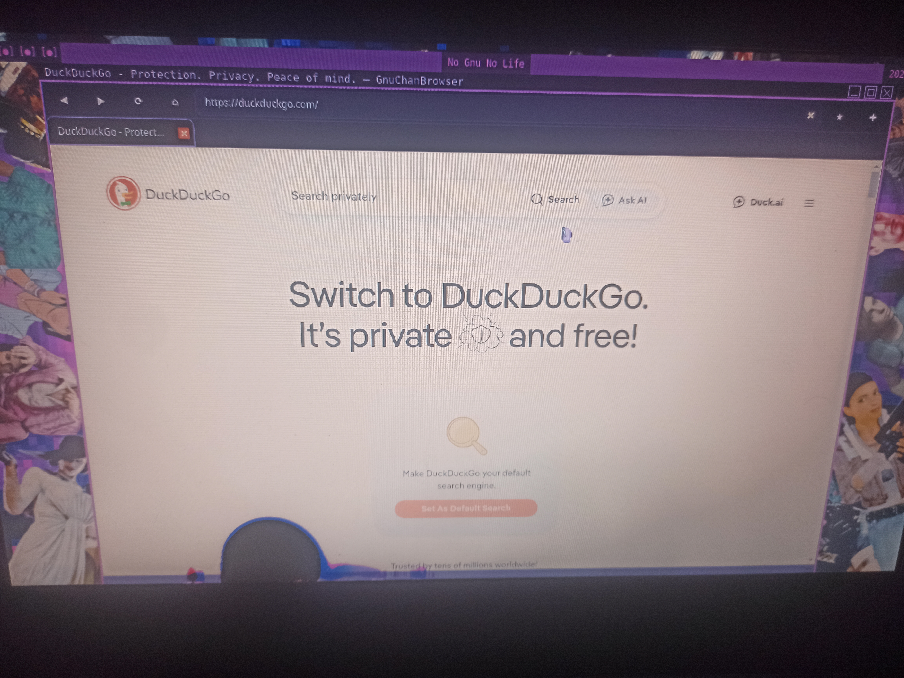

# GnuchanOS

# distro --> it's not ready

The surrounding operating-system distribution — shell environment, package set and
desktop — is **not ready**.

# Language And Platform -> Ready

[Language README(language \ _SRC \ readme.md)]

- GCL -> RAYLIB and RAYGUI native MODULE
  - EXTRA PYTHON EMBED SYSTEM -> PyRaylib and PyRaygui
  - EXTRA LUA EMBED SYSTEM -> LuaRaylib and LuaRaygui

# [GNUCHANOS Softwares]

Tested on a very old computer: a Dell Vostro A860.

- GnuChanDM --> GnuChan Display Manager is simple display manager
  
- GnuChanWM --> GnuChan Window Manager is simple x11 Window Manager
  
- GnuChanTop --> GnuChan Top is a simple system monitor
  
- GnuChanSL --> GnuChan Screen Lock is simple x11 Screen Lock
  
- GnuChanSS --> GnuChan Screen Saver is simple x11 Screen Saver
  
- GnuChanRunner --> GnuChan Simple Program Runner like rofi
  
- GnuChanTerm --> GnuChan Terminal is simple xterm like terminal
- GnuChanFetch --> GnuChan Fetch is simple neofetch like program supports .png
  
- GnuChanDock --> GnuChan Simple Dock program
  
- GnuChanBrowser --> GnuChan Simple Qt Engine Browser
  

[GNUCHANOS DOTFILE]

- READY: GRUB THEME
- READY: GTK THEME
- READY: ICON THEME
- READY: MOUSE ICON THEME
- READY: PLYMOUTH THEME
- READY: TOUCHPAD SETTINGS
- READY: VOSTRO, X440WAK settings and fix

[SIMPLE INSTALL SCRIPT] [IT SIMPLE SCRIPT JUST INSTALLING PROGRAMS FIRST READ SCRIPT]

- dotfile/Install_Software.py

[GNUCHANOS] [DISTRO STILL WORK IN PROGRESS]

- GOAL: ISO LIVE DESKTOP
- IMAGE COMING SOON

I NEED SLEEP
