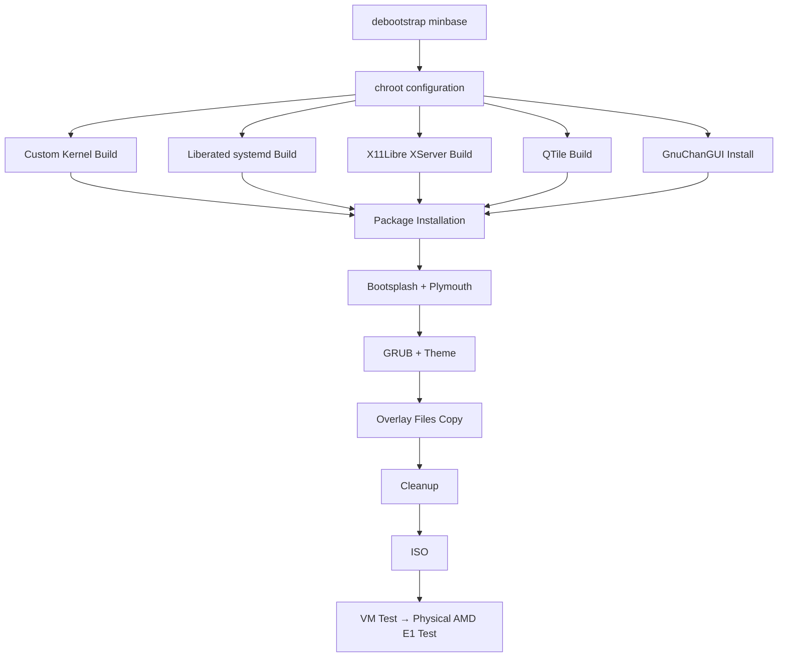

# GnuchanOS — Minimal Debian-Based Distribution Plan

> **Goal:** An optimized, minimal Debian-based distribution built from scratch for the AMD E1 processor.
> **Core Philosophy:** Minimal, free, self-sufficient. Everything in our hands.
> **Repository:** `D:\GnuchanOS\_template` (C: full → all operations on D:)
> **Build Environment:** Debian VM / WSL 2 (no building on AMD E1)

GnuChanGUI: https://github.com/gnuchanos/GnuChanGUI — my tk-based GUI library, will be auto-installed.

---

## 1. Components / Technologies

| Component | Source | Description |
|-----------|--------|-------------|
| **Root System** | debootstrap (minbase) | Debian Bookworm/Trixie |
| **XServer** | https://github.com/x11libre/xserver | X.org libre fork, AMD E1 Radeon friendly |
| **Init System** | https://github.com/Jeffrey-Sardina/liberated-systemd | Minimal systemd, no unnecessary units |
| **WM** | https://github.com/qtile/qtile (from source) | Python-based, dynamic, lightweight |
| **Bootsplash** | Plymouth + custom theme | Custom boot animation with logo.png |
| **GRUB** | GRUB2 + custom theme | bg.png background, logo.png icon |
| **Kernel** | Debian kernel or custom build | Optimized for AMD E1 + Radeon |
| **Development** | C (kernel modules/system), Python (qtile/GUI) | GnuchanOS tool set |

---

## 2. Existing Assets (To Be Used)

### `D:\GnuchanOS\logo.png`
- **Usage:** GRUB menu icon, Plymouth bootsplash logo, OS logo
- **Format:** PNG (existing)
- **Target:**
  - `overlay/boot/grub/themes/gnuchanos/logo.png`
  - `overlay/usr/share/plymouth/themes/gnuchanos/logo.png`
  - `overlay/usr/share/gnuchanos/logo.png`

### `D:\GnuchanOS\bg.png`
- **Usage:** GRUB background, Plymouth background, default wallpaper
- **Format:** PNG (existing)
- **Target:**
  - `overlay/boot/grub/themes/gnuchanos/background.png`
  - `overlay/usr/share/backgrounds/gnuchanos/bg.png`

### `D:\GnuchanOS\dotfile\qtile\` (FULL CONTENT)

| File | Usage |
|------|-------|
| `config.py` | QTile main config — groups, keybindings, bar, widgets |
| `autostart.py` | QTile startup script — compositor, wallpaper, notifications |
| `picom.conf` | Window compositor settings (blur, shadow, corner-radius) |
| `img/gnu.png` | GnuchanOS logo in the bar |
| `img/ram.png` | RAM icon in the bar |
| `img/rem.png` | Right-side icon in the bar |
| `img/wallpaper.jpg` | Alternative wallpaper |
| `Programs/` | GnuchanOS Python GUI applications (detailed below) |

### QTile Programs (Python GUI — GnuChanGUI library)

| Program | Shortcut | Function |
|---------|----------|----------|
| `SimpleCalculator.py` | `Win+C` | Calculator |
| `SimpleTextEditor.py` | `Win+Shift+T` | Text editor (tabs) |
| `SimpleProgramRunner.py` | `Win+R` | Program launcher |
| `SimpleTimer.py` | `Win+T` | Timer |
| `SimpleMusicPlayer.py` | `Win+M` | Music player |
| `SimpleSVAR.py` | `Win+Shift+R` | SVAR tool |
| `DMV.py` | `Win+Shift+D` | Video/Music downloader (yt-dlp) |
| `SimpleWineContainer.py` | `Ctrl+Shift+W` | Wine prefix manager |
| `screenShoot.py` | `Win+S` | Screenshot |

> **NOTE:** All these programs use the `GnuChanGUI` library. This library must be included in the distro (not in dotfile, must be provided separately).

---

## 3. Project Directory Structure

```
_template/
├── rootfs/                          # debootstrap output
├── iso/                             # ISO output
├── cache/                           # Build cache (git clones, .deb files)
│
├── scripts/
│   ├── 01-bootstrap.sh              # debootstrap — base root system
│   ├── 02-chroot-configure.sh       # chroot: apt, locale, user, hostname
│   ├── 03-kernel.sh                 # Kernel config + build (AMD E1 optimized)
│   ├── 04-liberated-systemd.sh      # Liberated systemd build + install
│   ├── 05-xlibre-xserver.sh         # X11Libre XServer build + install
│   ├── 06-qtile.sh                  # QTile source build + config deploy
│   ├── 07-gnuchangui.sh             # GnuChanGUI clone + install
│   ├── 08-packages.sh               # Package installation
│   ├── 09-bootsplash.sh             # Plymouth + GnuchanOS theme
│   ├── 10-grub.sh                   # GRUB + GnuchanOS theme
│   ├── 11-cleanup.sh                # Minimization, cleanup
│   ├── 12-iso.sh                    # ISO creation
│   ├── setup-build-env.sh           # Build environment dependency install
│   └── build-all.sh                 # Main orchestrator
│
├── overlay/                         # Files to be added to root
│   ├── etc/
│   │   ├── hostname                 # GnuchanOS
│   │   ├── hosts
│   │   ├── os-release
│   │   ├── apt/sources.list
│   │   ├── environment
│   │   ├── default/grub             # GRUB_CMDLINE, theme, GFX
│   │   ├── kernel/cmdline           # Boot parameters
│   │   ├── plymouth/plymouthd.conf
│   │   ├── initramfs-tools/modules
│   │   ├── X11/xorg.conf.d/         # AMD Radeon configuration
│   │   ├── sudoers.d/gnuchan        # sudo permissions
│   │   └── systemd/system/getty@tty1.service.d/  # auto-login
│   │
│   ├── boot/grub/
│   │   ├── grub.cfg                 # Live boot config
│   │   └── themes/gnuchanos/
│   │       ├── theme.txt
│   │       ├── background.png       # bg.png
│   │       ├── icons/               # logo.png based icons
│   │       └── fonts/               # DejaVu (bold)
│   │
│   ├── usr/share/
│   │   ├── plymouth/themes/gnuchanos/
│   │   │   ├── gnuchanos.plymouth   # [plymouth theme] definition
│   │   │   ├── gnuchanos.script     # Animation script
│   │   │   ├── logo.png             # logo.png
│   │   │   ├── box.png              # Text box
│   │   │   ├── bullet.png           # Progress dot
│   │   │   ├── entry.png            # Password entry
│   │   │   └── watermark.png        # Watermark (opt.)
│   │   ├── backgrounds/gnuchanos/
│   │   │   ├── bg.png               # bg.png (for GRUB)
│   │   │   └── wallpaper.jpg        # img/wallpaper.jpg
│   │   └── gnuchanos/
│   │       ├── logo.png
│   │       ├── logo.asc             # ASCII logo
│   │       └── motd                 # Message of the day
│   │
│   └── home/gnuchan/
│       ├── .bashrc                  # Custom prompt
│       ├── .bash_aliases            # GnuchanOS aliases
│       ├── .xinitrc                 # startx → X11Libre + QTile
│       └── .config/
│           ├── qtile/
│           │   ├── config.py        # dotfile/qtile/config.py
│           │   ├── autostart.py     # dotfile/qtile/autostart.py
│           │   ├── picom.conf       # dotfile/qtile/picom.conf
│           │   ├── img/             # dotfile/qtile/img/* (gnu.png, ram.png, rem.png, wallpaper.jpg)
│           │   └── Programs/        # dotfile/qtile/Programs/*.py
│           ├── GnuChanGUI/          # GnuChanGUI library files
│           └── picom/picom.conf     # picom.conf symlink
│
├── config/
│   ├── packages-required.txt        # Required packages
│   ├── packages-optional.txt        # Optional packages
│   ├── packages-purge.txt           # Packages to remove
│   ├── kernel-config                # Custom kernel .config (for AMD E1)
│   ├── liberated-systemd.units      # Active units
│   └── qtile-dependencies.txt       # QTile build dependencies
│
└── PLAN.md
```

---

## 4. AMD E1 Optimization Details

AMD E1-2100/2200/2500 (Kabini/Mullins, 2013-2014)

### Kernel Boot Parameters
```
radeon.modeset=1              # AMD GPU
processor.max_cstate=1        # E1 stability (deep C-state problematic)
zswap.enabled=1               # Low RAM, compress with zswap
zswap.max_pool_percent=40     # Maximum zswap usage
vm.swappiness=10              # Avoid swap
mitigations=off               # Speculative mitigations unnecessary on E1
nopti                         # No gain from PTI
no_stf                        # CPU only 2 cores
quiet splash                  # Plymouth boot
init=/lib/systemd/systemd     # Liberated systemd
```

### Kernel Modules (ONLY required ones)
- **GPU/DRM:** `radeon`, `ttm`, `drm_kms_helper`, `drm`
- **Storage:** `ahci`, `libata`, `sd_mod`, `usb_storage`
- **Filesystem:** `ext4`, `btrfs` (opt.), `vfat`
- **Network:** `r8169` (Realtek), `e1000` (Intel), `alx` (Atheros)
- **Audio:** `snd_hda_intel`, `snd_hda_codec`
- **Input:** `evdev`, `psmouse`
- **NOTE:** Bluetooth, Thunderbolt, parallel port, FireWire, NFC, WiMAX, TV tuner, etc. DISABLED

### RAM Optimization
- `vm.vfs_cache_pressure=50` — inode/dentry cache cleaned slower
- `vm.dirty_ratio=10` — low dirty page ratio for low RAM
- `vm.dirty_background_ratio=3`
- `kernel.numa_balancing=0` — E1 single NUMA node
- zram: 1 GB zram disk (compressed swap)

---

## 5. QTile Build & Integration

QTile will be **built from source** (not pip, as a system package):

```bash
# Dependencies
git clone https://github.com/qtile/qtile.git /tmp/qtile
cd /tmp/qtile
pip3 install --prefix=/usr .
# or: python3 setup.py build → DESTDIR install
```

### QTile Configuration (dotfile/qtile/config.py adaptation)

Taken from existing config.py:
- **Key combinations:** `mod4` (Win) + letters
- **Groups:** 6 groups (⬤ symbol)
- **Layout:** Columns + Max
- **Bar (top):** GroupBox, Systray, Clock, logo images
- **Bar (bottom):** CPU, RAM, Net, HDD, Temperature sensor
- **Color scheme:** Purple tones (`#240046`, `#5a189a`, `#9d4edd`, `#c77dff`)
- **PicOM:** `picom.conf` with blur, shadow, rounded corners

### Required Adaptations
- `autostart.py` → adjust `bg.png` path for overlay
- `InternetDeviceName` → auto-detect based on E1 hardware
- `Programs/` → copy as-is
- `GnuChanGUI` library → include in overlay

---

## 6. X11Libre XServer + Liberated systemd

### X11Libre Build
```bash
git clone https://github.com/x11libre/xserver.git /tmp/xserver
cd /tmp/xserver
meson setup build/ \
  -Dglx=true \
  -Dglamor=false \
  -Ddri3=true \
  -Dudev=true \
  -Dsystemd_logind=true \
  -Dxnest=false \
  -Dxwayland=false \
  -Dxvfb=false
ninja -C build/
ninja -C build/ install DESTDIR=$ROOTFS
```

### Liberated systemd Build
```bash
git clone https://github.com/Jeffrey-Sardina/liberated-systemd.git /tmp/libert
cd /tmp/libert
meson setup build/ \
  -Drootprefix=/usr \
  -Dsysvinit=false \
  -Dpam=false \
  -Dacl=false \
  -Daudit=false \
  -Dgcrypt=false \
  -Dgnutls=false \
  -Dmicrohttpd=false \
  -Dquotacheck=false \
  -Dtmpfiles=true \
  -Dhwdb=true \
  -Dman=false
ninja -C build/
ninja -C build/ install DESTDIR=$ROOTFS
```

---

## 7. GnuChanGUI Integration Detail

### Source
```bash
# Clone GnuChanGUI library into overlay during build (script 07-gnuchangui.sh)
git clone https://github.com/gnuchanos/GnuChanGUI.git /tmp/gnuchangui
cp -r /tmp/gnuchangui/gnuchangui $OVERLAY/home/gnuchan/.config/GnuChanGUI/
```

### Integration Points
| Component | Integration |
|-----------|-------------|
| **Install script** | `07-gnuchangui.sh` — runs after pip dependencies, before packages |
| **Overlay path** | `overlay/home/gnuchan/.config/GnuChanGUI/` |
| **Python path** | QTile Programs import via `sys.path.insert(0, os.path.expanduser("~/.config/GnuChanGUI"))` |
| **Dependencies** | tkinter (built-in Python3), PIL/Pillow (pip package) |

### Import in QTile Programs
All programs in `Programs/` currently import GnuChanGUI. This path must exist:
```python
import sys, os
sys.path.insert(0, os.path.expanduser("~/.config/GnuChanGUI"))
from gnuchangui import *
```

### Build Script (07-gnuchangui.sh)
```bash
#!/bin/bash
set -euo pipefail
echo "=== 07: GnuChanGUI ==="

git clone https://github.com/gnuchanos/GnuChanGUI.git "$CACHE/gnuchangui"
mkdir -p "$OVERLAY/home/gnuchan/.config/GnuChanGUI"
cp -r "$CACHE/gnuchangui/gnuchangui" "$OVERLAY/home/gnuchan/.config/GnuChanGUI/"
chown -R 1000:1000 "$OVERLAY/home/gnuchan/.config/GnuChanGUI"
echo "GnuChanGUI installed."
```

---

## 8. Build Pipeline



### Step-by-Step Process

| # | Script | Operation | Duration | Dependency |
|---|--------|-----------|----------|------------|
| 1 | `01-bootstrap.sh` | `debootstrap --variant=minbase` | 2-5 min | Internet |
| 2 | `02-chroot-configure.sh` | hostname, apt, locale, user, sudo | 2 min | Step 1 |
| 3 | `03-kernel.sh` | Kernel build (AMD E1 .config) | 15-45 min | Step 2 |
| 4 | `04-liberated-systemd.sh` | Liberated systemd build | 5-15 min | Step 2 |
| 5 | `05-xlibre-xserver.sh` | X11Libre build | 10-30 min | Step 2 |
| 6 | `06-qtile.sh` | QTile source build | 5-15 min | Step 2 |
| 7 | `07-gnuchangui.sh` | GnuChanGUI clone + install | 1 min | Step 2 |
| 8 | `08-packages.sh` | Package installation (overlay) | 5-10 min | Step 5,6,7 |
| 9 | `09-bootsplash.sh` | Plymouth theme install | 2 min | Step 8 |
| 10 | `10-grub.sh` | GRUB theme + boot params | 2 min | Step 8 |
| 11 | `11-cleanup.sh` | apt clean, doc/log removal | 1 min | Step 10 |
| 12 | `12-iso.sh` | mksquashfs + xorriso ISO | 10-30 min | Step 11 |
| - | `build-all.sh` | All steps + error handling | ~1-2 hours | - |

### Script Conventions & Shared Variables

All scripts use these shared environment variables, set at the top of `build-all.sh`:

```bash
#!/bin/bash
set -euo pipefail

# === Project Paths ===
export PROJECT_DIR="$(cd "$(dirname "$0")/.." && pwd)"
export ROOTFS="$PROJECT_DIR/rootfs"
export ISO_DIR="$PROJECT_DIR/iso"
export CACHE="$PROJECT_DIR/cache"
export OVERLAY="$PROJECT_DIR/overlay"
export CONFIG="$PROJECT_DIR/config"
export SCRIPTS="$PROJECT_DIR/scripts"

# === Build Config ===
export DISTRO="bookworm"                    # or trixie
export ARCH="amd64"
export USERNAME="gnuchan"
export PASSWORD="gnuchan"                   # CHANGE for production
export HOSTNAME="gnuchanos"
export LANGUAGE="en_US.UTF-8"
export KEYBOARD_LAYOUT="us"
export TIMEZONE="UTC"

# === Misc ===
export DEBIAN_FRONTEND="noninteractive"
export TMPDIR="$CACHE/tmp"
mkdir -p "$TMPDIR"
```

### Error Handling Convention
- Every script uses `set -euo pipefail` at the top
- `build-all.sh` calls each script and checks exit code:
  ```bash
  for script in "$SCRIPTS"/[0-9]*.sh; do
      echo "=== Running $(basename "$script") ==="
      if bash "$script"; then
          echo "=== $(basename "$script") OK ==="
      else
          echo "=== FAILED: $(basename "$script") ==="
          exit 1
      fi
  done
  ```
- Logs are written to `$CACHE/build.log`

---

## 9. GRUB Customization Details

### `/etc/default/grub`
```grub
GRUB_DEFAULT=0
GRUB_TIMEOUT=5
GRUB_GFXMODE=1024x768x32
GRUB_GFXPAYLOAD_LINUX=keep
GRUB_CMDLINE_LINUX_DEFAULT="quiet splash radeon.modeset=1 \
  processor.max_cstate=1 zswap.enabled=1 vm.swappiness=10 \
  mitigations=off nopti no_stf"
GRUB_CMDLINE_LINUX=""
GRUB_BACKGROUND="/boot/grub/themes/gnuchanos/background.png"
GRUB_THEME="/boot/grub/themes/gnuchanos/theme.txt"
GRUB_DISTRIBUTOR="GnuchanOS"
```

### Theme (`/boot/grub/themes/gnuchanos/theme.txt`)
```text
title-text: "GnuchanOS 1.0 — Minimal"
title-color: "#9d4edd"
title-font: "DejaVu Sans Bold 18"
desktop-image: "background.png"
desktop-color: "#0e0024"

+ boot_menu {
    left = 25%
    top = 25%
    width = 50%
    height = 50%
    item_color = "#c77dff"
    selected_item_color = "#ffffff"
    item_height = 40
    item_padding = 10
    item_spacing = 5
    icon_width = 32
    icon_height = 32
    item_icon_space = 10
    scrollbar = true
}

+ progress_bar {
    id = "__timeout__"
    width = 50%
    height = 20
    left = 25%
    top = 80%
    thumb_color = "#9d4edd"
    highlight = true
}
```

### Live Boot GRUB Config (`overlay/boot/grub/grub.cfg`)

This file is used when booting the ISO in live mode:

```grub
set timeout=10
set default=0

menuentry "GnuchanOS 1.0 — Live (BIOS)" {
    linux /boot/vmlinuz boot=live live-media-path=/live \
          quiet splash radeon.modeset=1 \
          processor.max_cstate=1 zswap.enabled=1 \
          vm.swappiness=10 mitigations=off nopti no_stf \
          init=/lib/systemd/systemd
    initrd /boot/initrd.img
}

menuentry "GnuchanOS 1.0 — Live (BIOS, nomodeset)" {
    linux /boot/vmlinuz boot=live live-media-path=/live \
          quiet splash radeon.modeset=0 nomodeset \
          processor.max_cstate=1 \
          init=/lib/systemd/systemd
    initrd /boot/initrd.img
}

menuentry "GnuchanOS 1.0 — Live (BIOS, debug)" {
    linux /boot/vmlinuz boot=live live-media-path=/live \
          radeon.modeset=1 loglevel=7 systemd.log_level=debug \
          init=/lib/systemd/systemd
    initrd /boot/initrd.img
}

menuentry "Boot from first hard disk" {
    set root=(hd0)
    chainloader +1
}
```

> **NOTE:** The `boot=live live-media-path=/live` parameters tell the initramfs-tools (or casper) to mount the SquashFS from `/live/filesystem.squashfs` on the ISO.

---

## 10. Plymouth Bootsplash Details

### `gnuchanos.script`
```javascript
// Simple animation: logo fade-in + spinning progress
Logo = Image("logo.png");
Logo.SetPosition(Window.GetWidth() / 2 - Logo.GetWidth() / 2,
                  Window.GetHeight() / 2 - Logo.GetHeight() / 2 - 50);

// Progress bullets
Bullet = Image("bullet.png");
for (i = 0; i < 6; i++) {
    Bullet[i].SetPosition(...);
    Bullet[i].SetOpacity(0.3);
}

fun message_callback(text) {
    // Boot message (opt.)
}
```

### `gnuchanos.plymouth`
```text
[Plymouth Theme]
Name=GnuchanOS
Description=GnuchanOS Boot Splash
ModuleName=script

[script]
ImageDir=/usr/share/plymouth/themes/gnuchanos
ScriptFile=/usr/share/plymouth/themes/gnuchanos/gnuchanos.script
```

---

## 11. OS Release

```
PRETTY_NAME="GnuchanOS 1.0 (Minimal)"
NAME="GnuchanOS"
VERSION_ID="1.0"
VERSION="1.0 (Minimal)"
VERSION_CODENAME=gnuchanos
ID=gnuchanos
ID_LIKE=debian
HOME_URL="https://github.com/gnuchanos/GnuchanOS"
SUPPORT_URL="https://github.com/gnuchanos/GnuchanOS"
BUG_REPORT_URL="https://github.com/gnuchanos/GnuchanOS"
LOGO=/usr/share/gnuchanos/logo.png
ANSI_COLOR="0;36"
```

---

## 12. Package List (Draft)

### packages-required.txt
```
# Base
adduser apt bash bash-completion ca-certificates coreutils cpio curl
dash debconf debianutils diffutils dpkg e2fsprogs findutils gawk git gpg
grep gzip hostname initramfs-tools iproute2 iptables iputils-ping kmod
less libc-bin locales login man-db mawk mount nano ncurses-base
ncurses-term netbase openssh-client openssh-server procps sed sudo tar
tzdata udev util-linux wget xz-utils zstd

# X11 + Display
xinit x11-utils x11-xserver-utils xdg-utils xterm
feh (wallpaper)
dunst (notifications)
dmenu (program launcher)
lxappearance (theme)

# Development
python3 python3-pip python3-venv python3-setuptools python3-wheel
build-essential gcc make meson ninja-build
libpixman-1-dev libepoxy-dev libdrm-dev libgbm-dev libxcb*-dev
libxcvt-dev libxfont2-dev libxkbfile-dev libpciaccess-dev
libudev-dev libdbus-1-dev

# Audio
pulseaudio pavucontrol

# Qtile dependencies (installed via pip)
# cairocffi, xcffib, dbus-next, pywlroots (wayland)

# QTile Program dependencies
yt-dlp (DMV.py)
ffmpeg
wine wine32 wine64 winetricks (optional, SimpleWineContainer.py)

# Network
network-manager

# GnuChanGUI library (overlay)
# tkinter? or pygame? — depends on GnuChanGUI
```

### packages-purge.txt
```
bluetooth bluez cups* exim4* firefox-esr* gnome* kde* lxde* xfce4*
libreoffice* snapd flatpak thunderbird avahi-* mlocate
pulseaudio-module-bluetooth
rsync (opt.)
```

---

## 13. Network Management

### Approach
**NetworkManager** is the primary network manager (lightweight, no GNOME dependency).

### Packages
```
network-manager
network-manager-openvpn (optional)
wireless-tools (for WiFi scanning)
rfkill (for WiFi enable/disable)
```

### Configuration (`overlay/etc/NetworkManager/NetworkManager.conf`)
```ini
[main]
plugins=keyfile
dhcp=internal
hostname-mode=none

[connectivity]
interval=0

[device]
match-device=*
managed=true
```

### Default Connection
- Ethernet: DHCP auto (no config needed, NM handles it)
- WiFi: disabled until user configures via `nmtui` (nmcli-based TUI, lightweight)

### Key Consideration for AMD E1
AMD E1 (Kabini) typically has **Realtek RTL810xE** or **Atheros AR8152** Ethernet.
WiFi is usually **Atheros AR9485** or **Realtek RTL8723BE**.
The kernel modules `r8169`, `alx`, `ath9k` handle these — all included in kernel config.

---

## 14. Keyboard Layout & Locale Configuration

### System Language: English (US)
```
LANG=en_US.UTF-8
LANGUAGE=en_US:en
LC_ALL=en_US.UTF-8
```

### Keyboard Layout: US
- `/etc/default/keyboard`:
  ```
  XKBMODEL="pc105"
  XKBLAYOUT="us"
  XKBVARIANT=""
  XKBOPTIONS=""
  BACKSPACE="guess"
  ```

### Timezone: UTC (default, user can change)
```
ln -sf /usr/share/zoneinfo/UTC /etc/localtime
```

### Locale Generation
In `02-chroot-configure.sh`:
```bash
sed -i 's/^# *en_US.UTF-8/en_US.UTF-8/' /etc/locale.gen
locale-gen
update-locale LANG=en_US.UTF-8 LANGUAGE=en_US:en LC_ALL=en_US.UTF-8
```

### Console Keymap
```bash
# US keymap for console (non-X)
echo "KEYMAP=us" > /etc/vconsole.conf
```

> **NOTE:** If Turkish keyboard is needed: change `us` → `tr` in keyboard config and locale-gen `tr_TR.UTF-8`.

---

## 15. QTile Keybindings (from existing config.py)

| Shortcut | Function |
|----------|----------|
| `Win+Return` | Terminal (xterm) |
| `Win+Shift+Return` | guake + ranger (file manager) |
| `Win+W` | Close window |
| `Win+Tab` | Next layout |
| `Win+1-6` | Switch group |
| `Win+Shift+1-6` | Move window to group |
| `Win+↑↓←→` | Change focus |
| `Win+Shift+↑↓←→` | Move window |
| `Win+Ctrl+↑↓←→` | Resize window |
| `Win+F` | dmenu (program launcher) |
| `Win+C` | Calculator |
| `Win+T` | Timer |
| `Win+M` | Music player |
| `Win+R` | Program runner |
| `Win+S` | Screenshot |
| `Win+Shift+D` | Video/Music downloader |
| `Win+Shift+T` | Text editor |
| `Win+Shift+R` | SVAR tool |
| `Win+Shift+W` | Wine container manager |
| `Win+Shift+Z` | lxappearance (theme) |
| `Win+L` | leafpad |
| `Win+P` | pavucontrol (audio) |

---

## 16. Target Sizes

| Component | Size |
|-----------|------|
| debootstrap rootfs (bare) | ~150 MB |
| + Custom kernel | ~200 MB |
| + Liberated systemd | ~30 MB |
| + X11Libre XServer | ~30 MB |
| + QTile + Python + dependencies | ~100 MB |
| + Plymouth, GRUB, overlay | ~30 MB |
| **ISO (compressed)** | **~400-600 MB** |
| **Installed disk usage** | **~1-2 GB** |
| **RAM idle** | **< 256 MB (target < 180 MB)** |

---

## 17. Startup & Display Manager / Auto-Login

### Philosophy
No heavyweight Display Manager (no GDM, LightDM, SDDM).
Use **direct console auto-login → `startx`** for maximum minimalism.

### Auto-Login via systemd override
`overlay/etc/systemd/system/getty@tty1.service.d/autologin.conf`:
```ini
[Service]
ExecStart=
ExecStart=-/sbin/agetty --autologin gnuchan --noclear %I $TERM
```

### `.xinitrc` (start X11Libre + QTile)
`overlay/home/gnuchan/.xinitrc`:
```bash
#!/bin/bash
# Start X11Libre XServer with QTile

# Set correct display
export DISPLAY=:0

# Start pulseaudio if not running
pulseaudio --start --daemonize 2>/dev/null || true

# Set wallpaper via feh (if feh installed)
feh --bg-scale /usr/share/backgrounds/gnuchanos/bg.png 2>/dev/null || true

# Start notification daemon
dunst 2>/dev/null &

# Start compositor
picom --config ~/.config/qtile/picom.conf 2>/dev/null &

# Start QTile
exec qtile start
```

### Bash Profile (auto-start X on TTY1 login)
In `overlay/home/gnuchan/.bash_profile`:
```bash
# Auto-start X on TTY1 (console login)
if [ -z "$DISPLAY" ] && [ "$(tty)" = "/dev/tty1" ]; then
    startx
fi
```

### Boot Sequence
```
GRUB → kernel + initrd → Plymouth (bootsplash) →
→ getty@tty1 auto-login `gnuchan` → .bash_profile →
→ startx → .xinitrc → X11Libre → QTile
```

---

## 18. Security & User Configuration

### User Account
| Field | Value |
|-------|-------|
| **Username** | `gnuchan` |
| **Password** | `gnuchan` (⚠️ **CHANGE for production/release**) |
| **Shell** | `/bin/bash` |
| **Home** | `/home/gnuchan` |
| **Groups** | `gnuchan`, `sudo`, `audio`, `video`, `plugdev` |

### Root Account
- Root password is **locked** (no password login).
- Root access via `sudo -s` or `sudo <command>`.
- `sudo` configured to not require password for `gnuchan`:

### `/etc/sudoers.d/gnuchan`
```
gnuchan ALL=(ALL) NOPASSWD: ALL
```

### SSH Configuration
- SSH server is **installed but disabled by default**:
  ```bash
  systemctl disable ssh.service
  ```
- To enable: `sudo systemctl enable --now ssh.service`
- SSH key-based auth only (password login disabled in sshd_config):
  ```
  PasswordAuthentication no
  PermitRootLogin no
  ```

### `/etc/hosts`
```
127.0.0.1   localhost
127.0.1.1   gnuchanos.localdomain gnuchanos

# IPv6
::1         localhost ip6-localhost ip6-loopback
ff02::1     ip6-allnodes
ff02::2     ip6-allrouters
```

### `/etc/environment`
```
PATH=/usr/local/sbin:/usr/local/bin:/usr/sbin:/usr/bin:/sbin:/bin
LANG=en_US.UTF-8
LANGUAGE=en_US:en
LC_ALL=en_US.UTF-8
EDITOR=nano
```

---

## 19. Todo (Global)

### Phase 1: Preparation
- [ ] Build VM/WSL environment setup
- [ ] Debian version selection (bookworm or trixie)
- [ ] Finalize package lists
- [ ] Prepare kernel .config (for AMD E1)

### Phase 2: Scripts
- [ ] `01-bootstrap.sh`
- [ ] `02-chroot-configure.sh`
- [ ] `03-kernel.sh`
- [ ] `04-liberated-systemd.sh`
- [ ] `05-xlibre-xserver.sh`
- [ ] `06-qtile.sh`
- [ ] `07-gnuchangui.sh`
- [ ] `08-packages.sh`
- [ ] `09-bootsplash.sh`
- [ ] `10-grub.sh`
- [ ] `11-cleanup.sh`
- [ ] `12-iso.sh`
- [ ] `setup-build-env.sh`
- [ ] `build-all.sh`

### Phase 3: Overlay / Theme
- [ ] GRUB theme files (bg.png, theme.txt, icons)
- [ ] GRUB live boot grub.cfg
- [ ] Plymouth theme files (logo.png, script, plymouth)
- [ ] QTile configuration (config.py, autostart.py, picom.conf)
- [ ] QTile img/ files (gnu.png, ram.png, rem.png, wallpaper.jpg)
- [ ] QTile Program/ files (12 Python scripts)
- [ ] GnuChanGUI library integration
- [ ] `.bashrc`, `.bash_profile`, `.xinitrc`, `.bash_aliases`
- [ ] `os-release`, `hostname`, `hosts`, `environment`, `motd`, `logo.asc`
- [ ] Auto-login systemd override
- [ ] NetworkManager config
- [ ] Keyboard / locale config files
- [ ] X11/xorg.conf.d/ (AMD Radeon config)
- [ ] sudoers config
- [ ] `sources.list`, `initramfs-tools/modules`

### Phase 4: Test
- [ ] ISO VM boot test (QEMU/VirtualBox)
- [ ] AMD E1 physical device test
- [ ] X11Libre + QTile startup test
- [ ] Plymouth bootsplash test
- [ ] GRUB theme display test
- [ ] All QTile programs functional test
- [ ] RAM usage measurement (< 256 MB)
- [ ] Audio test (pulseaudio)
- [ ] Network test (NetworkManager)
- [ ] USB boot test (Rufus/dd)

### Phase 5: Documentation
- [ ] README.md (what is GnuchanOS, installation)
- [ ] INSTALL.md (installation from ISO)
- [ ] BUILD.md (build your own ISO)
- [ ] CONFIG.md (configuration details)

---

## 20. Future (Phase 2)

- [ ] **Custom Window Manager** — written from scratch in C (QTile temporary)
- [ ] **Custom Display Manager** — written from scratch in C
- [ ] **GnuChanGUI library** — as official package
- [ ] Own APT repository
- [ ] GnuchanOS desktop environment (advanced)
- [ ] Non-E1 hardware support

---

## 21. Critical Notes

- **C: full** → All operations under `D:\GnuchanOS\_template`. Env vars like `TMPDIR`, `CCACHE_DIR`, `DEBOOTSTRAP_DIR` must point to D:
- **AMD E1 cannot build** — Cross-compile may be needed, or build on a more powerful machine
- **Liberated systemd experimental** — if it fails, fall back to upstream systemd with minimal config
- **X11Libre experimental** — if it fails, fall back to minimal Xorg installation
- **GnuChanGUI library** not in dotfile — cloned from GitHub during build (see Section 7)
- **Proton/wine** — wine dependency for SimpleWineContainer.py, optional package
- **QTile supports two backends:** X11 (current) and Wayland (future). X11 will be used.
- **Wayland later** — config.py has `wl_input_rules` but currently X11-focused

### Fallback Plan Details

| Primary | Fallback | Trigger | Implementation |
|---------|----------|---------|----------------|
| **Liberated systemd** | Upstream systemd minimal | If build fails or boot broken | In `build-all.sh`: check exit code of `04-liberated-systemd.sh`; if fail, `apt install -y systemd` from Debian repos |
| **X11Libre XServer** | Xorg minimal | If build fails or X won't start | In `build-all.sh`: check exit code of `05-xlibre-xserver.sh`; if fail, `apt install -y xserver-xorg-core xserver-xorg-video-radeon` |
| **Custom kernel** | Debian kernel (linux-image-amd64) | If build fails | In `build-all.sh`: check exit code of `03-kernel.sh`; if fail, `apt install -y linux-image-amd64 firmware-linux` |
| **QTile (source)** | QTile (pip) | If source build fails | `pip3 install qtile` instead of source build |

Fallback logic in `build-all.sh`:
```bash
run_script "03-kernel.sh" || {
    echo "WARNING: Custom kernel build failed, using Debian kernel"
    chroot "$ROOTFS" apt install -y linux-image-amd64 firmware-linux
}
run_script "04-liberated-systemd.sh" || {
    echo "WARNING: Liberated systemd build failed, using upstream systemd"
    chroot "$ROOTFS" apt install -y systemd
}
run_script "05-xlibre-xserver.sh" || {
    echo "WARNING: X11Libre build failed, using Xorg"
    chroot "$ROOTFS" apt install -y xserver-xorg-core xserver-xorg-video-radeon
}
```

---

## 22. ISO Output Details

### Build Environment
- **Build machine:** Debian 12/13 VM or WSL2 (Debian)
- **Storage:** `D:\GnuchanOS\_template` — all operations in this directory
- **Mount points during build:** `_template/rootfs/` (root system), `_template/iso/` (ISO output)
- **Cache:** `_template/cache/` (git clones, downloaded packages)

### ISO Creation Tools

| Tool | Task |
|------|------|
| `debootstrap` | Root system creation (minbase) |
| `mksquashfs` | Rootfs → SquashFS compression (zstd) |
| `xorriso` | ISO 9660 + El Torito + EFI boot layer |
| `grub-mkrescue` | Alternative ISO creation (GRUB based) |
| `live-build` (opt.) | High-level ISO builder (currently custom script) |

### ISO Structure (Hybrid — BIOS + EFI)

```
gnuchanos.iso
├── [EFI Boot Partition] (FAT32, esp)
│   ├── EFI/BOOT/BOOTx64.EFI       # GRUB EFI binary
│   └── EFI/BOOT/grub.cfg           # GRUB config (EFI path)
│
├── boot/                            # BIOS boot
│   ├── grub/
│   │   ├── grub.cfg                 # Live boot GRUB config
│   │   ├── fonts/                   # Unicode font
│   │   ├── themes/gnuchanos/        # Custom theme
│   │   └── x86_64-efi/              # EFI modules
│   ├── vmlinuz-*                    # Kernel
│   └── initrd.img-*                 # Initramfs
│
├── live/                            # Live system
│   └── filesystem.squashfs          # Compressed rootfs
│
└── isolinux/                        # ISOLINUX/SYSLINUX (BIOS fallback)
    ├── isolinux.bin
    ├── ldlinux.c32
    └── isolinux.cfg
```

### ISO Creation Commands (12-iso.sh summary)

```bash
# 1. Create SquashFS
mksquashfs "$ROOTFS" "$ISO_DIR/live/filesystem.squashfs" \
  -comp zstd -Xcompression-level 15 \
  -noappend -e boot

# 2. Copy kernel + initrd to ISO root
cp "$ROOTFS/boot/vmlinuz"* "$ISO_DIR/boot/vmlinuz"
cp "$ROOTFS/boot/initrd.img"* "$ISO_DIR/boot/initrd.img"

# 3. Copy GRUB live config from overlay
cp "$OVERLAY/boot/grub/grub.cfg" "$ISO_DIR/boot/grub/grub.cfg"

# 4. Create hybrid ISO with xorriso
xorriso -as mkisofs \
  -iso-level 3 \
  -full-iso9660-filenames \
  -volid "GNUCHANOS" \
  -eltorito-boot boot/grub/bios.img \
  -no-emul-boot \
  -boot-load-size 4 \
  -boot-info-table \
  --eltorito-catalog boot/grub/boot.cat \
  -eltorito-alt-boot \
  -e boot/grub/efi.img \
  -no-emul-boot \
  -isohybrid-gpt-basdat \
  -o "$OUTPUT_ISO" "$ISO_DIR"
```

### Output File
```
_template/iso/gnuchanos.iso
```

### Target Sizes

| Component | Size |
|-----------|------|
| SquashFS (compressed rootfs) | ~300-500 MB |
| Kernel + initrd | ~50 MB |
| GRUB + theme + isolinux | ~20 MB |
| **ISO total (estimated)** | **~400-600 MB** |

---

## 23. Build Environment Setup Script

Before running `build-all.sh`, the build machine (Debian VM/WSL2) needs these packages:

### `scripts/setup-build-env.sh`
```bash
#!/bin/bash
set -euo pipefail

echo "=== Setting up GnuchanOS Build Environment ==="

# System packages required for building
apt update
apt install -y \
  debootstrap \
  squashfs-tools \
  xorriso \
  grub-common \
  grub-pc-bin \
  grub-efi-amd64-bin \
  grub-efi-amd64-signed \
  mtools \
  dosfstools \
  isolinux \
  syslinux-common \
  git \
  wget \
  curl \
  build-essential \
  gcc \
  make \
  meson \
  ninja-build \
  python3 \
  python3-pip \
  python3-venv \
  python3-setuptools \
  python3-wheel \
  libpixman-1-dev \
  libepoxy-dev \
  libdrm-dev \
  libgbm-dev \
  libxcb*-dev \
  libxcvt-dev \
  libxfont2-dev \
  libxkbfile-dev \
  libpciaccess-dev \
  libudev-dev \
  libdbus-1-dev \
  pkg-config \
  bison \
  flex \
  bc \
  kmod \
  cpio \
  rsync

echo "=== Build environment ready ==="
```

### Requirements per OS

| OS | Setup Command |
|----|---------------|
| **Debian/Ubuntu** | Run `setup-build-env.sh` (uses apt) |
| **WSL2 (Debian)** | Run `setup-build-env.sh` (same) |
| **Arch Linux** | `pacman -S debootstrap squashfs-tools xorriso grub mtools dosfstools isolinux syslinux`... (manual) |
| **Fedora** | `dnf install debootstrap squashfs-tools xorriso grub2 mtools dosfstools syslinux`... (manual) |

> **NOTE:** When building on WSL2, ensure you have at least 10 GB free space in the WSL2 image.
> On Windows: `wsl --shutdown` then restart WSL if you need to expand the ext4 vhdx.

---

## 24. VirtualBox Test Process

### Requirements
- **VirtualBox** (latest, https://www.virtualbox.org)
  - Windows: `choco install virtualbox` or `.exe` installer
  - Linux: `apt install virtualbox`
- **ISO file:** `_template/iso/gnuchanos.iso` (after build completes)
- **At least:** 2 GB free RAM, 10 GB free disk

### VM Creation Steps

| Step | Action |
|------|--------|
| 1 | **VirtualBox → New (Ctrl+N)** |
| 2 | **Name:** `GnuchanOS` |
| 3 | **Type:** `Linux` → **Version:** `Debian (64-bit)` |
| 4 | **RAM:** `2048 MB` (E1 has 4 GB physical, 2 GB enough in VM) |
| 5 | **Disk:** `Create a virtual hard disk now` → **Size:** `16 GB` → **Type:** `VDI` → **Size:** `Dynamically allocated` |
| 6 | **Settings → Storage:** Attach ISO to empty IDE/SATA (`gnuchanos.iso`) |
| 7 | **Settings → System:** |
|    | - Processor: `2 CPU` |
|    | - EFI: `Unchecked` (ISO hybrid → BIOS boot preferred) |
|    | - Boot order: `Optical → Hard disk` |
| 8 | **Settings → Display:** |
|    | - Video Memory: `128 MB` |
|    | - Acceleration: `Enable 3D + 2D` |
|    | - Graphics Controller: `VMSVGA` |
| 9 | **Settings → Network:** `NAT` (for internet connectivity) |
| 10 | **Start** → ISO should boot |

### Test Scenarios

| # | Test | Expected Result |
|---|------|----------------|
| 1 | **GRUB menu** | GnuchanOS theme visible, menu readable, bg.png background |
| 2 | **Plymouth bootsplash** | Logo animation, progress bullets, boot messages |
| 3 | **X11Libre + QTile startup** | Purple bar, group symbols, systray, clock |
| 4 | **Terminal (Win+Return)** | xterm opens, `gnuchan@gnuchanos` prompt |
| 5 | **dmenu (Win+F)** | Program launcher menu |
| 6 | **Calculator (Win+C)** | SimpleCalculator GUI |
| 7 | **Text Editor (Win+Shift+T)** | SimpleTextEditor tabbed interface |
| 8 | **Music Player (Win+M)** | SimpleMusicPlayer |
| 9 | **Timer (Win+T)** | SimpleTimer |
| 10 | **Program Runner (Win+R)** | SimpleProgramRunner |
| 11 | **Screenshot (Win+S)** | screenShoot works |
| 12 | **Video/Music Downloader (Win+Shift+D)** | DMV interface |
| 13 | **SVAR (Win+Shift+R)** | SVAR tool |
| 14 | **Wine Container (Ctrl+Shift+W)** | SimpleWineContainer (if wine installed) |
| 15 | **RAM usage** | `free -h` → < 256 MB (target < 180 MB) |
| 16 | **Audio** | `speaker-test` or pavucontrol |
| 17 | **Network** | `ping google.com` → success |
| 18 | **Reboot** | GRUB → Plymouth → QTile cycle clean |

### Troubleshooting (VM)

| Issue | Possible Solution |
|-------|-------------------|
| **Black screen (after GRUB)** | Try `VBoxSVGA` instead of `VMSVGA` in VM settings; boot with `radeon.modeset=0` |
| **Plymouth not showing** | Check kernel params contain `splash` and `quiet`; is `plymouthd` service active? |
| **QTile not starting** | Try `startx` manually; check `.xinitrc` and `config.py` for errors |
| **XServer not starting** | Check `/var/log/Xorg.0.log`; verify `xlibre` binary exists |
| **No audio** | Run `pulseaudio --start`; `pactl info`; select `ICH AC97` or `Intel HD Audio` controller in VM |
| **No network** | Run `nmcli device status`; try `dhclient` manually; try `Bridged` instead of `NAT` in VM |
| **ISO won't boot** | Check EFI is disabled; hybrid ISO supports both BIOS and EFI but VM should prefer BIOS |
| **GRUB theme missing** | Verify `GRUB_BACKGROUND` and `GRUB_THEME` paths correct; do theme files exist in overlay? |
| **RAM too high** | Use `ps aux --sort=%mem` to find bloated process; disable unnecessary services |

### Items to Confirm in VM Before Moving to Physical AMD E1

- [ ] GRUB menu + theme renders correctly
- [ ] Plymouth animation works
- [ ] X11Libre XServer starts successfully
- [ ] QTile starts, bar visible
- [ ] All keyboard shortcuts work
- [ ] All programs can open and close
- [ ] Audio output works
- [ ] Network connectivity works
- [ ] RAM < 256 MB idle
- [ ] Reboot works cleanly
- [ ] ISO size < 700 MB (fits on a CD)

---

## 25. Installation Mechanism (Live vs. Installed)

### Phase 1: Live-Only (ISO)
The first ISO version is **live-only**. It boots into a fully functional GnuchanOS desktop, but changes are not persistent (ramdisk).

### Phase 2: Persistent Live USB (Optional)
Add `persistent` kernel parameter and a writable partition labeled `GNUCANOS_PERSIST`:
```grub
linux /boot/vmlinuz boot=live live-media-path=/live persistent quiet splash ...
```

### Phase 3: Installer (Future)
For a full install-to-disk option, one of these approaches:

| Approach | Complexity | Size | Notes |
|----------|-----------|------|-------|
| **Manual dd/image** | Low | Large (4 GB dd image) | `dd if=gnuchanos.img of=/dev/sda` — crude but works |
| **Custom shell script** | Medium | Minimal | `install.sh` — partition, mkfs, copy, install GRUB |
| **Calamares** | High | ~20 MB | Mature, used by Manjaro/Ubuntu Studio; Python/C++ Qt |

Recommended: **Custom shell script** approach — matches the distribution's minimal philosophy.

### `install.sh` (Concept)
```bash
#!/bin/bash
# GnuchanOS Installer (interactive)
set -euo pipefail

echo "=== GnuchanOS Installer ==="
lsblk
read -p "Target disk (e.g. /dev/sda): " DISK
read -p "Confirm: this will erase $DISK (yes/no): " CONFIRM
[ "$CONFIRM" = "yes" ] || exit 1

# Partition
parted "$DISK" mklabel msdos
parted "$DISK" mkpart primary ext4 1MiB 100%
parted "$DISK" set 1 boot on

# Format
mkfs.ext4 -L gnuchanos "${DISK}1"

# Copy system
mount "${DISK}1" /mnt
unsquashfs -f -d /mnt /run/live/medium/live/filesystem.squashfs

# Install GRUB
grub-install --target=i386-pc --recheck "$DISK"
grub-mkconfig -o /mnt/boot/grub/grub.cfg

umount /mnt
echo "=== Installation complete! Reboot ==="
```

---

## 26. USB Writing Instructions

### Writing ISO to USB (for physical AMD E1 test)

#### Option A: Windows — Rufus (Recommended)
1. Download [Rufus](https://rufus.ie) (portable version)
2. Insert USB drive (≥ 2 GB, 4 GB+ recommended)
3. Open Rufus:
   - **Device:** Select your USB drive
   - **Boot selection:** `SELECT` → choose `gnuchanos.iso`
   - **Partition scheme:** `MBR` (BIOS-compatible)
   - **Target system:** `BIOS or UEFI`
   - **File system:** `FAT32` (default)
4. Click **START**
5. After completion, safely eject USB → insert into AMD E1 → boot from USB

#### Option B: Windows — balenaEtcher
1. Download [balenaEtcher](https://www.balena.io/etcher/)
2. Select ISO → Select USB → Flash

#### Option C: Linux — dd
```bash
# Find USB device
lsblk
# Example: /dev/sdb

# Write ISO (⚠️ BE CAREFUL — wrong device = data loss)
sudo dd if=gnuchanos.iso of=/dev/sdb bs=4M status=progress conv=fsync
sync
```

#### Option D: Linux — Ventoy (Multi-ISO)
```bash
# Install Ventoy to USB once, then just copy the ISO
sudo ventoy -i /dev/sdb
cp gnuchanos.iso /media/Ventoy/
```

### ⚠️ WARNING
- Writing ISO to USB **will destroy all data on the target device**
- Double-check the device path (`/dev/sdb` vs `/dev/sda`)
- On AMD E1, USB 2.0 ports are preferred for boot compatibility

---

## 27. Overlay File Contents Reference

### `overlay/etc/hostname`
```
gnuchanos
```

### `overlay/etc/hosts`
```
127.0.0.1   localhost
127.0.1.1   gnuchanos.localdomain gnuchanos

::1         localhost ip6-localhost ip6-loopback
ff02::1     ip6-allnodes
ff02::2     ip6-allrouters
```

### `overlay/etc/os-release`
(see Section 11 — OS Release)

### `overlay/etc/apt/sources.list`
```deb
deb http://deb.debian.org/debian bookworm main contrib non-free-firmware
deb http://deb.debian.org/debian-security bookworm-security main contrib non-free-firmware
deb http://deb.debian.org/debian bookworm-updates main contrib non-free-firmware
```
> **NOTE:** Change `bookworm` → `trixie` if using testing. Use a local mirror if available.

> **⚠️ C: SÜRÜCÜSÜ DOLU — GEÇİCİ DOSYALAR D:\'DE:** `D:\GnuchanOS\_tempWork\` tüm geçici build dosyaları (tmp, ccache, debootstrap cache, pip/apt cache, git clone'lar, loglar, indirmeler) için kullanılır. Build script'leri (`build-all.sh`, `setup-build-env.sh`) çalıştırılmadan önce aşağıdaki ortam değişkenleri WSL/Linux tarafında set edilmelidir:
> ```bash
> export TMPDIR=/mnt/d/GnuchanOS/_tempWork/tmp
> export CCACHE_DIR=/mnt/d/GnuchanOS/_tempWork/ccache
> export PIP_CACHE_DIR=/mnt/d/GnuchanOS/_tempWork/pip
> export APT_CACHE_DIR=/mnt/d/GnuchanOS/_tempWork/apt
> export GIT_CLONE_DIR=/mnt/d/GnuchanOS/_tempWork/git
> ```
> Makefile: `D:\GnuchanOS\_tempWork\Makefile` — `make setup` ile dizin yapısı kurulur, `make clean`/`make distclean` ile temizlik yapılır.

### `overlay/etc/environment`
```
PATH=/usr/local/sbin:/usr/local/bin:/usr/sbin:/usr/bin:/sbin:/bin
LANG=en_US.UTF-8
LANGUAGE=en_US:en
LC_ALL=en_US.UTF-8
EDITOR=nano
```

### `overlay/etc/initramfs-tools/modules`
```
# GPU
radeon
ttm
drm_kms_helper
drm

# Storage
ahci
libata
sd_mod
usb_storage

# Filesystem
ext4
vfat

# Input
evdev
psmouse
```

### `overlay/etc/X11/xorg.conf.d/10-radeon.conf`
```conf
Section "Device"
    Identifier "AMD Radeon"
    Driver "radeon"
    Option "AccelMethod" "EXA"
    Option "DRI" "3"
    Option "TearFree" "true"
    Option "SWCursor" "true"
EndSection

Section "Screen"
    Identifier "Default Screen"
    Device "AMD Radeon"
    DefaultDepth 24
EndSection
```

### `overlay/usr/share/gnuchanos/logo.asc`
```text
    ╔══════════════════════════════╗
    ║  ██████╗ ███╗   ██╗██╗   ██╗ ║
    ║ ██╔════╝ ████╗  ██║██║   ██║ ║
    ║ ██║  ███╗██╔██╗ ██║██║   ██║ ║
    ║ ██║   ██║██║╚██╗██║██║   ██║ ║
    ║ ╚██████╔╝██║ ╚████║╚██████╔╝ ║
    ║  ╚═════╝ ╚═╝  ╚═══╝ ╚═════╝  ║
    ║     GNU + Chan = Freedom      ║
    ╚══════════════════════════════╝
```

### `overlay/usr/share/gnuchanos/motd`
```

  ██████╗ ███╗   ██╗██╗   ██╗ ██████╗██╗  ██╗ █████╗ ███╗   ██╗ ██████╗ ███████╗
 ██╔════╝ ████╗  ██║██║   ██║██╔════╝██║  ██║██╔══██╗████╗  ██║██╔═══██╗██╔════╝
 ██║  ███╗██╔██╗ ██║██║   ██║██║     ███████║███████║██╔██╗ ██║██║   ██║███████╗
 ██║   ██║██║╚██╗██║██║   ██║██║     ██╔══██║██╔══██║██║╚██╗██║██║   ██║╚════██║
 ╚██████╔╝██║ ╚████║╚██████╔╝╚██████╗██║  ██║██║  ██║██║ ╚████║╚██████╔╝███████║
  ╚═════╝ ╚═╝  ╚═══╝ ╚═════╝  ╚═════╝╚═╝  ╚═╝╚═╝  ╚═╝╚═╝  ╚═══╝ ╚═════╝ ╚══════╝

  GnuchanOS 1.0 — Minimal Debian-Based Distribution
  https://github.com/gnuchanos/GnuchanOS

  * Core Philosophy: Minimal, Free, Self-Sufficient
  * Window Manager: QTile (python)
  * XServer: X11Libre
  * Init: Liberated systemd

  Hardware: AMD E1 (Kabini/Mullins) + Radeon HD 8210
  RAM target: < 256 MB idle
```

### `overlay/home/gnuchan/.bashrc`
```bash
# ~/.bashrc — GnuchanOS custom prompt

# Color prompt
PS1='\[\e[0;35m\]\u\[\e[0;37m\]@\[\e[0;35m\]\h\[\e[0;37m\]:\[\e[0;36m\]\w\[\e[0;37m\]\$ '

# Aliases
if [ -f ~/.bash_aliases ]; then
    . ~/.bash_aliases
fi

# Editor
export EDITOR=nano

# Python
export PYTHONSTARTUP=~/.pythonrc 2>/dev/null || true
```

### `overlay/home/gnuchan/.bash_aliases`
```bash
# System
alias update='sudo apt update'
alias upgrade='sudo apt upgrade'
alias install='sudo apt install'
alias remove='sudo apt remove'
alias search='apt search'
alias cleanup='sudo apt autoremove && sudo apt autoclean'
alias q='exit'

# Files
alias ll='ls -lh'
alias la='ls -lha'
alias tree='find . -maxdepth 2 -type d | sort'

# System Info
alias ram='free -h'
alias disk='df -h'
alias cpu='cat /proc/cpuinfo | grep "model name" | head -1'
alias temp='sensors'
alias ip='ip -c a'
alias ps='ps aux --sort=-%mem'

# QTile
alias restart-qtile='qtile cmd-obj -o cmd -f restart'
alias reload-qtile='qtile cmd-obj -o cmd -f reload_config'

# X
alias xrestart='startx'
```

### `overlay/home/gnuchan/.xinitrc`
```bash
#!/bin/bash
# .xinitrc — start X11Libre + QTile for GnuchanOS

export DISPLAY=:0

# PulseAudio
pulseaudio --start --daemonize 2>/dev/null || true

# Wallpaper
feh --bg-scale /usr/share/backgrounds/gnuchanos/bg.png 2>/dev/null || true

# Notifications
dunst 2>/dev/null &

# Compositor
picom --config ~/.config/qtile/picom.conf 2>/dev/null &

# Start QTile
exec qtile start
```

### `overlay/home/gnuchan/.bash_profile`
```bash
# ~/.bash_profile — auto-start X on TTY1
if [ -z "$DISPLAY" ] && [ "$(tty)" = "/dev/tty1" ]; then
    startx
fi
```

### `overlay/etc/sudoers.d/gnuchan`
```
gnuchan ALL=(ALL) NOPASSWD: ALL
```

### `overlay/etc/default/keyboard`
```
XKBMODEL="pc105"
XKBLAYOUT="us"
XKBVARIANT=""
XKBOPTIONS=""
BACKSPACE="guess"
```

### `overlay/etc/vconsole.conf`
```
KEYMAP=us
FONT=lat9-16
```

### `overlay/etc/NetworkManager/NetworkManager.conf`
```ini
[main]
plugins=keyfile
dhcp=internal
hostname-mode=none

[connectivity]
interval=0

[device]
match-device=*
managed=true
```

---

## 28. Target Sizes Summary

| Component | Size |
|-----------|------|
| debootstrap rootfs (bare) | ~150 MB |
| + Custom kernel | ~200 MB |
| + Liberated systemd | ~30 MB |
| + X11Libre XServer | ~30 MB |
| + QTile + Python + dependencies | ~100 MB |
| + GnuChanGUI + Programs | ~5 MB |
| + Plymouth, GRUB, overlay | ~30 MB |
| **ISO (compressed)** | **~400-600 MB** |
| **Installed disk usage** | **~1-2 GB** |
| **RAM idle** | **< 256 MB (target < 180 MB)** |
